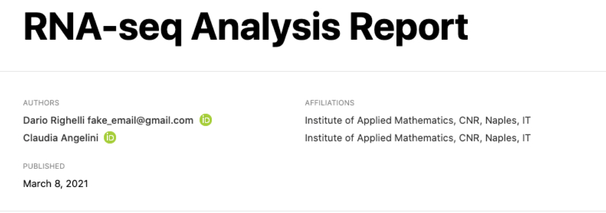
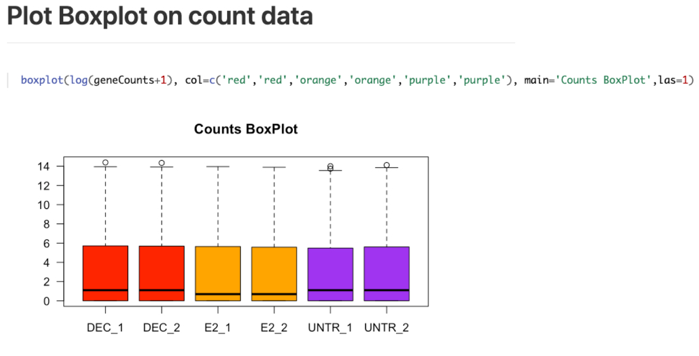
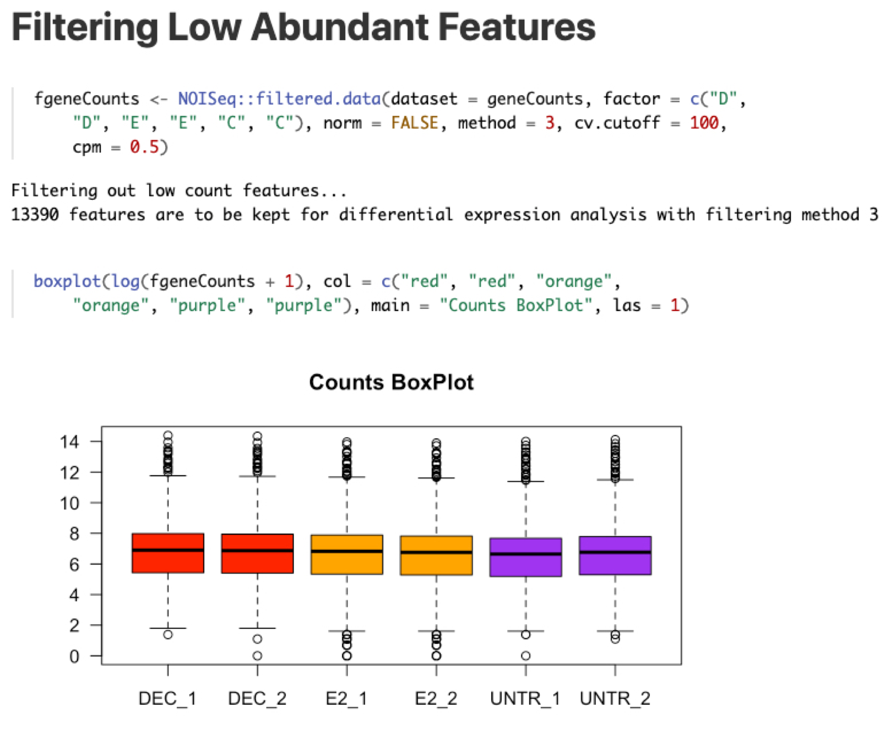
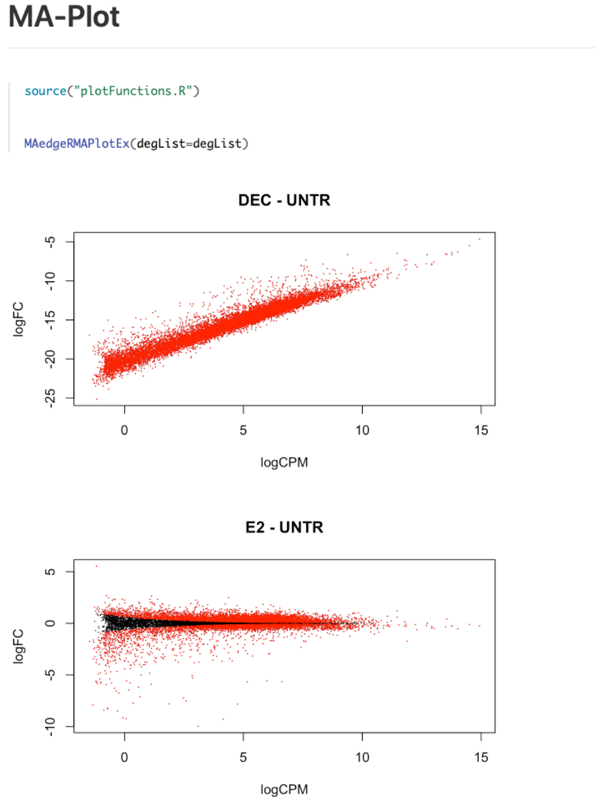

```{r global_options, include=FALSE}
knitr::opts_chunk$set(eval=TRUE, echo=TRUE, warning=FALSE, message=FALSE, include=TRUE, cache=TRUE)
#knitr::opts_chunk$set(fig.pos = "!H", out.extra = "")
```

\newcommand{\beginsupplement}{%
        \setcounter{table}{0}
        \renewcommand{\thetable}{S\arabic{table}}%
        \setcounter{figure}{0}
        \renewcommand{\thefigure}{S\arabic{figure}}%
     }
     


# Abstract

*easyreporting* is an R/Bioconductor package developed to facilitate the 
implementation of Reproducible Research (RR) inside other packages/software with 
requiring low/no knowledge of the R Markdown language. 

More in detail, *easyreporting* is an S4 class that schematically represents 
the structure of a R Markdown file. 
Therefore, with *easyreporting* an analysis report can be seen as a particular 
instance (i.e., R object) of the easyreporting class. 
A series of attributes and methods implemented with the class allow the user to 
structure the components of the report in the desired way, by adding titles, 
document sections, comments, code chunks, and so on (see Table S1 for the list 
of attributes and methods). The R object is step-by-step updated each time a new code chunk is added. 
At the end of the analysis, the R object can be compiled to produce the typical 
HTML report of the analysis that can be attached to a publication as supplementary material.

*easyreporting* can be useful in any data analysis project, but it turns out to 
be particularly useful in the bioinformatics field, where the complexity of the 
analyses makes it extremely difficult to trace all the steps and parameters used 
in the data analysis. Moreover, *easyreporting* can be also used by developers to 
automatically trace the analysis steps within Graphical User Interfaces (GUIs).

# General Description
## Package Installation 

*easyreporting* is available on Bioconductor since version 3.11 (R>=4.0).

To install it, please execute the following code:

```{r, eval=FALSE, warning=FALSE}
if (!requireNamespace("BiocManager", quietly = TRUE))
    install.packages("BiocManager")

BiocManager::install("easyreporting")
```

After the package is installed, the user needs to load the *easyreporting* 
package into the R workspace by using the following command

```{r, eval=FALSE}
library("easyreporting") 
```


\beginsupplement

## easyreporting Accessory Functions 

Supplementary Table S1 lists the additional accessory functions that can be 
easily imported with the `system.file` as examples of user-defined functions.
Note,  these functions do not belong to the *easyreporting* package, but they 
are released within the package as external scripts to show the user how to trace 
external functions.


\begin{table}
\begin{tabular}{l|l|l}
\hline
\textbf{Functions} & \textbf{Description} & \textbf{Package Location} \\ \hline
importData & wrapper for reading xlsx data file & script/importFunctions.R \\
applyEdgeREx & performs edgeR Differential Expression test & script/geneFunctions.R \\ 
MAedgeRMAPlotEx & shows an MA-plot starting from edgeR results & script/plotFunctions.R \\ 
VolcanoPlot & shows a Volcano-plot starting from edgeR results & script/plotFunctions.R \\ 
traceAndPlotMAPlot & wrapper for tracing and showing the MAedgeRMAPlotEx & script/plotFunctions.R \\ \hline

\end{tabular}
\caption{Accessory functions released with the *easyreporting* package.}
\end{table}


# easyreporting Bulk RNA-seq Analysis

The following sub-sections are organized to offer an example of how *easyreporting* 
can be used to create an automatic R Markdown file describing a given bulk RNA-seq analysis.
For the sake of generality, we divided the analysis in several code chunks (CC) 
and we used in the CCs both functions from well-known R packages and user-defined functions.

To perform a complete walkthrough usage example, for each CC, we first show the 
*easyreporting* CC (section named "code side") with the R code that is needed to be tracked. 
Then, the same CC is presented as a piece of an R Markdown code (section named "rmarkdown side"). 
Such a rmarkdown code is auto produced by the *easyreporting* code side CC. Then, finally, 
the third section of the CC shows how the above R Markdown code appears as a piece of the 
final report (section named "report side"). 

The shown code has to be meant as illustrative for better understanding how *easyreporting* 
can be used to trace code and functions into a bigger project, such as a GUI for data
analysis.

## Dataset Description and RNA-seq pipeline

As an illustrative purpose, we consider an RNA-seq dataset (GEO Accession: 
[*GSE60231*](https://www.ncbi.nlm.nih.gov/geo/query/acc.cgi?acc=GSE60231)) 
selected from our previous work on CD8+ dendritic T-cells aimed to investigate 
the differences in the immune response of two different antibodies compared with control. 

The dataset contains the raw counts of 37991 genes and is composed of two 
replicates for each of the three conditions:

* DEC (fd-scaDEC-205 antibody samples) 

* E2 (E2 antibody samples), 

* UNTR (control samples)

See [1] for more details. 

A typical RNA-seq analysis starts from the mapping of the FASTQ sequences to a reference 
genome, followed by the gene expression quantification of each sample.
The quantification step leads to the so-called raw count matrix, with genes represented on 
the rows and samples on the columns, 
i.e., where each matrix element (i,j) contains the number of reads of 
the gene (i) in the sample (j). Such a phase is the most computationally demanding part and 
skipped in this example.

For illustrative purposes, here we start the analysis from the raw counts.  
The raw count file is released as supplementary data with the *easyreporting* 
package (file *BMDC_counts_FeaatureCounts.xlsx*). The illustrated pipeline will 
first load the data, perform some diagnostic plots, filter and normalize the raw 
count, and visualize the principal component projection. Then, it will perform 
differential gene expression analysis and depict the results in terms of a Venn 
diagram and MA-plots. Each phase is described by a specific CC. 

The first step requires to initialize the report, then it needs to be updated each time with
a new CC, adding sections and comments when necessary/possible.  At the end of the
analysis, the analyst can compile the final report by using the properly designed 
method. Each of the above-mentioned phases the *easyreporting* methods will be used.


## Report initialization

After loading the *easyreporting* package in the R environment, the it's necessary 
to initialize an analysis report by providing the file name (i.e., "rnaseq_report") 
and the title of the report (i.e., "RNA-seq Analysis Report"). 
It is also possible to specify an author (i.e., Dario Righelli).

For simplicity, we set-up a project directory path starting from the working 
directory for our report, but other locations can be chosen by setting the `file.path` parameter.

The initialization is carried out using the function  `easyreporting()`.
Note that the `filenamePath` and  `title`  are mandatory parameters, while the 
`author` is optional.


###  CC1 code side

To initialize the report, it can be used the following code

```{r}
library("easyreporting")
proj.path <- file.path(getwd(), "rnaseq_report")
bioEr <- easyreporting(filenamePath=proj.path, title="RNA-seq Analysis Report",
                       author=c("Dario Righelli"))
```

###  CC1 rmarkdown side

The above CC1 code initializes the object *bioEr* as an instance of the *easyreporting*
class and produces the following lines of code that define the header and the options CC inside the "rnaseq_report.rmd" file.

\begin{verbatim}
% ---
%     title: "bioinfo_report"
%     author: "Dario Righelli"
%     date: "`r Sys.Date()`"
%     output: rmarkdown::html_document
% ---
% 
% ```{r, include=FALSE}
% knitr::opts_chunk$set(eval=TRUE, echo=TRUE, warning=FALSE, message=FALSE, include=TRUE, cache=TRUE)
% ```
\end{verbatim}

### CC1 report side

Above CC1 R Markdown side adds into the report the Title, the 
date time and the author, and gives instructions 
for producing the HTML file format, as shown in Figure S1.



## Loading Data

Once the report is initialized, it can be added a CC for each step of the analysis. 
As mentioned in Section General Description, *easyreporting* provides two class methods for adding CCs within a report.

In the first case, it is needed to use the `mkdCodeChunkSt()` to open a new CC. 
Then, to add the code to the markdown, it can be used the 
`mkdVariableAssignment()` and/or the `mkdGeneralMsg()` functions, for tracking variables and functions. 
Finally, the CC can be closed by using the `mkdCodeChunkEnd()` function.

In the second approach the`mkdCodeChunkComplete()` function allows tracing the steps through the `message` parameter.

In both cases, it is possible to organize the report in sections, using the 
`mkdTitle()` function. Such operations will be repeated for each step of the analysis.

Here, we assume that to read the raw counts a 
user-defined function named `importData` is already stored 
in the `importFunctions.R` file available into the package "script" folder 
(see Supplementary Table S1) and we show as illustrative examples both approaches.

### CC2 code side

For the sake of illustration, here we use the first approach for adding the CC.
For this purpose, the analyst can use the following code.

```{r, eval=FALSE}
mkdTitle(bioEr, title="Loading Counts Data")
mkdCodeChunkSt(bioEr, sourceFilesList=system.file("script/importFunctions.R", 
                                    package="easyreporting"), isComplete=TRUE)
mkdVariableAssignment(bioEr, "geneCounts", paste("as.matrix(importData(system.file('",
                            "extdata/BMDC_counts_FeatureCounts.xlsx', ",
                            "package='easyreporting')))", sep="\n"), show=FALSE)
mkdGeneralMsg(bioEr, "head(geneCounts, 20)")
mkdCodeChunkEnd(bioEr)
```

For comparative purposes, the above code can be replaced by the following code that implements the second approach.

```{r, eval=FALSE}
mkdCodeChunkComplete(object=bioEr, message=paste("geneCounts <- ",  
                  "as.matrix(importData(system.file(",
                  "'extdata/BMDC_counts_FeatureCounts.xlsx', ", 
                  "package='easyreporting')))", "head(geneCounts, 20)", sep="\n"),
                  sourceFilesList=system.file("script/importFunctions.R", 
                  package="easyreporting"), 
                  optionList=makeOptionsList(evalFlag=FALSE))
```

Note that the `mkdCodeChunkComplete` allows also to provide specific
options for the CC which we are creating.
In particular, in this case, we turned the `evalFlag=FALSE` because we already processed 
the step with the previous CC, so the code will not be evaluated.


### CC2 rmarkdown side

The two above CC2 codes add the following CCs in the "rnaseq_report.rmd" file, 
which are identical.
As remarked previously, the second CC has the `eval=FALSE` set as its argument.
Moreover, this setting does not affects other global options of the report.

\begin{verbatim}
 
%# Loading Counts Data
%```{r eval=TRUE, echo=TRUE, warning=FALSE, message=FALSE, include=TRUE, cache=TRUE}
%source("/Library/Frameworks/R.framework/Versions/3.6/
%Resources/library/easyreporting/script/importFunctions.R")
%geneCounts <- as.matrix(importData(system.file('extdata/BMDC_counts_FeatureCounts.xlsx', 
%package='easyreporting')))
%head(geneCounts, 20)
%```
%
%```{r eval=FALSE, echo=TRUE, warning=FALSE, message=FALSE, include=TRUE, cache=TRUE}
%source("/Library/Frameworks/R.framework/Versions/3.6/
%Resources/library/easyreporting/script/importFunctions.R")
%geneCounts <- as.matrix(importData(system.file('extdata/BMDC_counts_FeatureCounts.xlsx', 
%package='easyreporting')))
%head(geneCounts, 20)
%```
\end{verbatim}

### CC2 report side

The above CC2 code corresponds to the part of the analysis report depicted in Figure S2.

```{r echo=FALSE, out.width='95%', fig.align='center', fig.pos='ht', fig.cap='The report section produced by the CC2 R Markdown code'}
knitr::include_graphics("imgs/21.png")
```


## Data Counts Exploration

When analyzing omics data, it is a good practice to visualize a series of graphs 
to understand how the samples are distributed and if specific problems have to be 
faced during the analysis.

The box-plot of the log-counts is an example of the possible plots that
can be used to compare the distribution of the samples.
This plot can be easily obtained using the R *boxplot* function.

To trace this step in the report, the `mkdCodeChunkComplete` function can be used 
to insert the boxplot function-call as the message to track in a new CC.


### CC3 code side

The analyst can use the following code.

```{r, eval=FALSE}
mkdTitle(bioEr, title="Plot Boxplot on count data", level=2)
mkdCodeChunkComplete(bioEr, message=paste0("boxplot(log(geneCounts+1),",
                        " col=c('red','red','orange','orange','purple','purple'),", 
                        " main='Counts BoxPlot',las=1)"))
```

### CC3 rmarkdown side

The above CC3 code adds the following CC in the "rnaseq_report.rmd" file.

\begin{verbatim}
% ## Plot Boxplot on count data
% ```{r eval=TRUE, echo=TRUE, warning=FALSE, message=FALSE, include=TRUE, cache=TRUE}
% boxplot(log(geneCounts+1), 
% col=c('red','red','orange','orange','purple','purple'), main='Counts BoxPlot',las=1)
% ```
\end{verbatim}


### CC3 report side


The above CC3 code corresponds to the part of the analysis report depicted in Figure S3.

```{r echo=FALSE, out.width='95%', fig.align='center', fig.pos='ht', fig.cap="The report section produced by the CC3 R Markdown side code"}

```

In particular, in this case, the figure shows that each sample has a great number 
of genes with 0 counts, suggesting that suitable filtering procedures have to be applied 
to the data before further processing.


## Filtering and Normalization steps

To perform the filtering step, we use the `filtered.data` function present 
in the *NOISeq* package.
After that, we can normalize the data across the samples using the 
`betweenLaneNormalization` from the *EDASeq* package and display the Principal 
Component Analysis (PCA) by using the `plotPCA` function of the *DESeq2* package.

To trace all function calls we need to repeatedly use the 
`mkdCodeChunkComplete` function for consecutive CCs.


### CC4 code side

The analyst can use the following code.

```{r, eval=FALSE}
mkdTitle(bioEr, title="Filtering Low Abundant Features", level=1)
mkdCodeChunkComplete(object=bioEr, message=paste("fgeneCounts <- ",
              "NOISeq::filtered.data(dataset=geneCounts, ",
              "factor=c('D', 'D', 'E', 'E', 'C', 'C'), norm=FALSE, method=3, cv.cutoff=100, cpm=0.5)",
              "boxplot(log(fgeneCounts+1),col=c('red','red','orange','orange','purple','purple'), ",
              "main='Counts BoxPlot',las=1)", sep="\n"))
```

### CC4 rmarkdown side

The above CC4 code adds the following CC in the "rnaseq_report.rmd" file.

\begin{verbatim}
% # Filtering Low Abundant Features
% ```{r eval=TRUE, echo=TRUE, warning=FALSE, message=FALSE, include=TRUE, cache=TRUE}
% fgeneCounts <- 
% NOISeq::filtered.data(dataset=geneCounts, 
% factor=c('D', 'D', 'E', 'E', 'C', 'C'), norm=FALSE, method=3, cv.cutoff=100, cpm=0.5)
% boxplot(log(fgeneCounts+1),col=c('red','red','orange','orange','purple','purple'), 
% main='Counts BoxPlot',las=1)
% ```
\end{verbatim}

### CC4 report side

The above CC4 code corresponds to the part of the analysis report depicted in Figure S4.

```{r echo=FALSE, out.width='90%', fig.align='center', fig.pos='ht', fig.cap="The report section produced by the CC4 R Markdown side code"}

```


### CC5 code side

For the normalization and the PCA, we implemented the following code.

```{r, eval=FALSE}
mkdTitle(bioEr, title="Normalizing Features Across Samples", level=1)
mkdCodeChunkComplete(object=bioEr, message=paste("nfgeneCounts <- ",
              "EDASeq::betweenLaneNormalization(fgeneCounts, which='upper')", sep="\n")

mkdTitle(bioEr, title="Plot PCA on count data", level=2)
mkdCodeChunkComplete(bioEr, message=paste("se <- SummarizedExperiment((log2(nfgeneCounts)+ 1), ",
                "colData=DataFrame(rownames=colnames(nfgeneCounts), " ,
                "condition=c('DEC', 'DEC', 'E2', 'E2', 'CTRL', 'CTRL')))",
                "DESeq2::plotPCA(DESeqTransform(se))", sep="\n"))
```

### CC5 rmarkdown side

The above CC5 code adds the following CC in the "rnaseq_report.rmd" file.

\begin{verbatim}
% # Normalizing Features Across Samples
% ```{r eval=TRUE, echo=TRUE, warning=FALSE, message=FALSE, include=TRUE, cache=TRUE}
% nfgeneCounts <- EDASeq::betweenLaneNormalization(fgeneCounts, which='upper')
% ```
% ## Plot PCA on count data
% ```{r eval=TRUE, echo=TRUE, warning=FALSE, message=FALSE, include=TRUE, cache=TRUE}
% 
% se <- SummarizedExperiment((log2(nfgeneCounts)+ 1),
% colData=DataFrame(rownames=colnames(nfgeneCounts), 
% condition=c('DEC', 'DEC', 'E2', 'E2', 'CTRL', 'CTRL')))
% 
% DESeq2::plotPCA(DESeqTransform(se))
% ```
\end{verbatim}

\newpage 
### CC5 report side

The above CC5 code corresponds to the part of the analysis report depicted in Figure S5.

```{r echo=FALSE, out.width='90%', fig.align='center', fig.pos='ht', fig.cap="The report section produced by the CC5 R Markdown side code"}

```
 

In particular, in this case, the figures show that the replicates are correctly 
associated and the treatments are correctly grouped.
It is possible to insert comments related to specific outputs as shown in the 
following CC.


## Differential Expression Analysis

Assuming that the data were correctly normalized, it is possible to perform the 
differential expression gene (DEG) analysis by using the  *edgeR* package.
To simplify such step, we assume to have a user-defined function named `applyEdgeREx()`
stored in the  *geneFunctions.R* that implements the required test.

Moreover, instead of using the `mkdCodeChunkComplete()`, here the `mkdCodeChunkCommented()` function can be used to allow to add a 
comment preceeding the code chunk using the `commentMsg` parameter.

For this analysis, we first tested the differences between  DEC and Control, 
then E2 and Control conditions.

### CC6 code side

This can be implemented with the following code.

```{r, eval=FALSE}
mkdCodeChunkTitledCommented(bioEr, title="Differential Expression Analysis",
                codeMsg=paste0("degList <- applyEdgeREx(counts=nfgeneCounts, ",
                "factors=c('DEC', 'DEC', 'E2', 'E2', 'UNTR', 'UNTR'), ",
                "contrasts=c('DEC - UNTR', 'E2 - UNTR'),",
                "p.threshold=1)"),
            commentMsg=paste("As we saw from the PCA, the groups are well separated, ",
            "so we can perform a Differential Expression analysis with edgeR.", sep="\n"),
            sourceFilesList=system.file("script/geneFunctions.R", package="easyreporting"))
```

### CC6 rmarkdown side

The above CC6 code adds the following CC in the "rnaseq_report.rmd" file.

\begin{verbatim}
% # Differential Expression Analysis
% As we saw from the PCA, the groups are well separated, 
% so we can perform a Differential Expression analysis with edgeR.
% ```{r eval=TRUE, echo=TRUE, warning=FALSE, message=FALSE, include=TRUE, cache=TRUE}
% source("/Library/Frameworks/R.framework/Versions/3.6/Resources/library/easyreporting/
% script/geneFunctions.R")
% degList <- applyEdgeREx(counts=nfgeneCounts, 
% factors=c('DEC', 'DEC', 'E2', 'E2', 'UNTR', 'UNTR'), 
% contrasts=c('DEC - UNTR', 'E2 - UNTR'), p.threshold=1)
% ```
\end{verbatim}

### CC6 report side

The above CC6 code corresponds to the part of the analysis report depicted in Figure S6.

```{r echo=FALSE, out.width='95%', fig.align='center', fig.pos='ht', fig.cap="The report section produced by the CC6 R Markdown side code"}

```

\newpage

## Differential Expressed Genes Inspection

The output of a DEG Analysis can be graphically represented by an MA-plot (or a 
Volcano plot) for each investigated contrast.

In this example, we can use the MA-plot and produce the graphic by 
using the `plot` function where to depict on the x-axis the log of the 
Counts per Million (CPM) and on the y-axis the log of the Fold Change (FC) 
computed by *edgeR* during the DEG analysis.
In the following plot, the genes are represented by the dots, in 
black the not significant genes and in red the significant DEGs.

With *easyreporting*, by the aid of `mkdCodeChunkComplete`, it is possible to
create a new title and a new chunk within one singular function-call.


### CC7 code side

The user can use the following code.

```{r, eval=FALSE}
mkdTitle(bioEr, "MA Plot of DEGs", level=2)
mkdCodeChunkComplete(bioEr, message=paste("for (i in seq_along(degList)) { ",
                            "degenes <- degList[[i]]$FDR < 0.01",
            "with(degList[[i]], plot(logCPM, logFC, pch=16, cex=0.2, ",
            "main=names(degList)[i]))",
            "with(degList[[i]], points(logCPM[degenes], logFC[degenes], ",
            "col='red', pch=16, cex=0.2))}", sep="\n"))
```

### CC7 rmarkdown side

The above CC7 code adds the following CC in the "rnaseq_report.rmd" file.

\begin{verbatim}
% ## MA Plot of DEGs
% ```{r eval=TRUE, echo=TRUE, warning=FALSE, message=FALSE, include=TRUE, cache=TRUE}
% for (i in seq_along(degList)) { degenes <- degList[[i]]$FDR < 0.01
% with(degList[[i]], plot(logCPM, logFC, pch=16, cex=0.2, main=names(degList)[i]))
% with(degList[[i]], points(logCPM[degenes], logFC[degenes], col='red', pch=16, cex=0.2))}
% ```
\end{verbatim}

\newpage

### CC7 report side

The above CC7 code corresponds to the part of the analysis report depicted in Figure S7.

```{r echo=FALSE, out.width='70%', fig.align='center', fig.pos='ht', fig.cap="The report section produced by the CC7 R Markdown side code"}

```

## DEGs Comparison

To compare the DEGs between the two main conditions (DEC and E2)
we can use a Venn Diagram, where each circle corresponds to the 
differentially expressed genes of a specific comparison.

### CC8 code side

The user can use the following code.

```{r, eval=FALSE}
mkdTitle(bioEr, "DEGs Venn Diagram", level=2)
mkdCodeChunkComplete(bioEr, message=paste("limma::vennDiagram(",
                  "limma::vennCounts(cbind(degList[[1]]$FDR < 0.01, ",
                  "degList[[2]]$FDR < 0.01)), names=c('DEC', 'E2'))",sep="\n"))
```

 

### CC8 rmarkdown side

The above CC8 code adds the following CC in the "rnaseq_report.rmd" file.

\begin{verbatim}
% ### DEGs Venn Diagram
% ```{r eval=TRUE, echo=TRUE, warning=FALSE, message=FALSE, include=TRUE, cache=TRUE}
% limma::vennDiagram(limma::vennCounts(
% cbind(degList[[1]]$FDR < 0.01, degList[[2]]$FDR < 0.01)), names=c('DEC', 'E2'))
% ```
\end{verbatim}

### CC8 report side

The above CC8 code corresponds to the part of the analysis report depicted in Figure S8.

```{r echo=FALSE, out.width='95%', fig.align='center', fig.pos='ht', fig.cap="The report section produced by the CC8 R Markdown side code"}

```

## Report Compilation

Once the analysis is completed, tha package allows to compile the produced 
"rnaseq_report.rmd" report simply by using the `compile()` method.
The `compile` method produces the final report (in HTML format) and 
automatically appends to the report end a CC with the sessionInfo() 
to trace all the package versions used for the analysis.

 

### CC9 code side

To compile the report, the analyst can use the following code.

```{r, eval=FALSE}
compile(bioEr)
```

\newpage 

### CC9 rmarkdown side

The above CC9 code adds the following CC in the "rnaseq_report.rmd" file.

\begin{verbatim}
% # Session Info
% 
% ```{r eval=TRUE, echo=TRUE, warning=FALSE, message=FALSE, include=TRUE, cache=TRUE}
% sessionInfo()
% ```
\end{verbatim}

### CC9 report side

The above CC9 code compiles the entire report and automatically adds at the end of the report a Session 
Info section as in the example in Figure S9.

```{r echo=FALSE, out.width='95%', fig.align='center', fig.pos='ht', fig.cap="The report section produced by the CC9 R Markdown side code"}

```


<!-- # Implementing Automatical Tracing Functions  -->

<!-- The above CC examples can be easily adapted to trace several other steps of an RNA-seq analysis pipeline, as well as other data analyses.  -->
<!-- However, they require the analysts to manually trace each step of the analysis. As a consequence, the above approach is useful for generating analysis reports, but it is not suited for the automatic tracing of the steps performed by GUIs. However, GUIs are becoming popular in bioinformatics because they simplify the bioinformatics analysis process, that, as shown also with this example, requires several steps, code, parameter settings and need of reproducibility. -->

<!-- *easyreporting* is also designed to support the automatic tracing of a function by combining a rendering function that performs the required step with a wrapping function that traces its execution. In this way, it can be used to support reproducibility within GUIs. -->

<!-- In the following, we show an example of how software developers can create functions that automatically show the results and trace the executed code. -->
<!-- We use the MA-plot as an illustrative example.  -->

<!-- ### CC code side  -->

<!-- First of all, the developer has to write a rendering function as the MA-plot rendering function, *MAedgeRMAPlotEx*, in our example. -->
<!-- This step can be achieved by simply copying and pasting the plot code into the rendering function as follows. -->

<!-- ```{r, eval=FALSE} -->
<!-- MAedgeRMAPlotEx <- function(degList) -->
<!-- { -->
<!--   for (i in seq_along(degList))  -->
<!--     { -->
<!--         degenes <- degList[[i]]$FDR < 0.01 -->
<!--         with(degList[[i]], plot(logCPM, logFC, pch=16, cex=0.2, main=names(degList)[i])) -->
<!--         with(degList[[i]], points(logCPM[degenes], logFC[degenes], col='red', pch=16, cex=0.2)) -->
<!--     } -->
<!-- } -->

<!-- ``` -->

<!-- Then, the developer needs to write a wrapper function (in our example *traceAndPlotMAPlot*) which takes as input the  -->
<!-- same parameters of the rendering function (here *MAedgeRMAPlotEx*) and a generic *easyreporting* object. -->

<!-- Within the wrapper function,  -->
<!-- the developer firstly calls the *mkdCodeChunkTitledCommented* function of *easyreporting*,  -->
<!-- where he/she inserts the rendering function call to be traced (ie., *MAedgeRMAPlotEx*) in the *codeMsg* parameter. -->
<!-- Then, he/she needs to add the call to the rendering function (*MAedgeRMAPlotEx*)  after the tracing function. -->
<!-- In this way, the wrapper function allows both to show the result to the user and trace the function in the same step. -->

<!-- ```{r, eval=FALSE} -->
<!-- traceAndPlotMAPlot <- function(degList, er) -->
<!-- { -->
<!--     mkdCodeChunkTitledCommented(er, title="Recursive Tracing Function", level=2, -->
<!--                                 codeMsg="MAedgeRMAPlotEx(degList=`degList`)") -->
<!--     MAedgeRMAPlotEx(degList=degList) -->
<!-- } -->
<!-- ``` -->

<!-- In the next CC, we present the functions that, for simplicity, we stored in the "plotFunctions.R" file,  -->
<!-- released with the *easyreporting* package, so it can be sourced to retrieve them. -->

<!-- After sourcing the "script/plotFunctions.R" with the functions definitions, -->
<!-- we are easy to place a *traceAndPlotMAPlot* function-call to execute it. -->

<!-- ```{r, eval=FALSE} -->
<!-- source(system.file("script/plotFunctions.R", package="easyreporting")) -->
<!-- traceAndPlotMAPlot(degList=degList, er=bioEr) -->
<!-- ``` -->

<!-- ### CC rmarkdown side -->

<!-- The above CC code adds the following CC in a report file. -->

<!-- \begin{verbatim} -->
<!-- % ## Recursive Tracing Function -->
<!-- % ```{r eval=TRUE, echo=TRUE, warning=FALSE, message=FALSE, include=TRUE, cache=TRUE} -->
<!-- % MAedgeRMAPlotEx(degList=`degList`) -->
<!-- % ``` -->
<!-- \end{verbatim} -->


<!-- ### CC report side -->

<!-- The above CC2 code corresponds to the part of the analysis report depicted in Figure S10. -->

<!-- ```{r echo=FALSE, out.width='75%', fig.align='center', fig.pos='ht', fig.cap="The report section produced by the CC R Markdown side code"} -->
<!-- knitr::include_graphics("imgs/10.png") -->
<!-- ``` -->


## References 

1. Costa, V., Righelli, D., Russo, F., De Berardinis, P., Angelini, C., & D’Apice, L. (2017). 
Distinct antigen delivery systems induce dendritic cells’ divergent transcriptional response: new insights from a comparative and reproducible computational analysis. 
International journal of molecular sciences, 18(3), 494.
